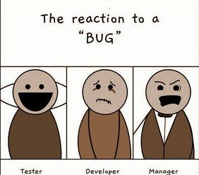

# 0x19 - Postmortem

# Summary
From 10-08-2024, 6:19 AM to 7:58 AM, the entire WordPress website experienced downtime, with 100% requests of the users unable to access the site, resulting in 500 error messages. The root cause was a misspelled file extension in the `wp-settings` file, attempting to read a `.phpp` file instead of `.php`.

# Timeline
- **6:19 AM:** Incident occurs, the entire website becomes inaccessible.
- **6:20 AM:** A customer reports the issue, indicating the site is down.
- **6:25 AM:** Operations team is notified following the customer complaint.
- **6:30 AM:** Initial analysis begins; the team checks server and database logs.
- **6:40 AM:** Misleading investigation paths include database connectivity and server resource allocation.
- **6:45 AM:** Focus shifts to the WordPress configuration files.
- **7:00 AM:** Misconfiguration identified using `strace` in the `wp-settings` class-wp-locale`.phpp` instead of `.php`
- **7:30 AM:** Initial attempt to correct the configuration fails due to cached errors.
- **7:45 AM:** The root cause is confirmed, and cache clearing and file correction are applied.
- **7:58 AM:** Service is fully restored.

# Root cause & resolution
The outage was caused by a typo in the `wp-settings` file, where a `.phpp` files was referenced instead of `.php`, leading to a fatal error that crashed the entire service. The issue was resolved by identifying the misspelled file extension, correcting it, and clearing the cache to apply the changes.
 
# Corrective & preventive measures
To prevent similar incidents:
- Implement stricter code reviews, particularly for configuration files.
- Automate syntax validation for key configuration files to catch errors like misspellings.
- Enhance monitoring tools to detect similar issues proactively before impacting users.
- Provide additional training to team members on common configuration pitfalls.

## Tasks:
- Implement a syntax checker for WordPress configuration files.
- Enhance monitoring to include real-time configuration validation.
- Conduct a workshop on common WordPress configuration errors.
- Update the response protocol to include more robust initial checks on configuration files.

